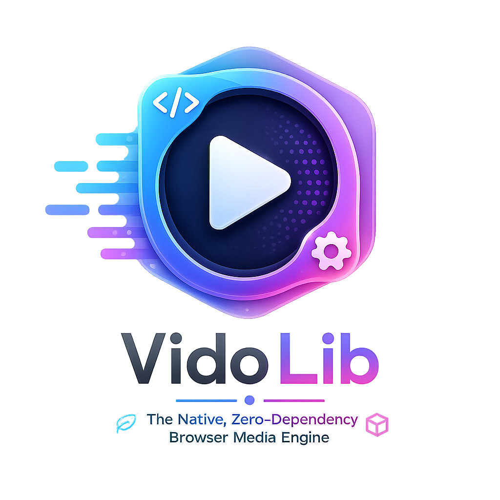

<div align="center">



---

### **The Native, Zero-Dependency Browser Media Engine**
*High-performance hardware-accelerated playback, transcoding, and processing for HLS, DASH, MP4, WebM, MKV, FLV, TS & Subtitles — without 30MB FFmpeg WASM bloat.*

[](https://www.typescriptlang.org/)
[](./LICENSING.md)
[](#-package-ecosystem)
[](./CONTRIBUTING.md)

[Quick Start](#-quick-start) • [Why No FFmpeg?](#-why-no-ffmpeg-wasm) • [Native Capabilities](#-native-browser-ffmpeg-equivalent-capabilities) • [Architecture](#-architecture-overview) • [Package Ecosystem](#-package-ecosystem) • [Contributing](#-contributing) • [Roadmap](./docs/ROADMAP.md)

</div>

---

## ✨ Why VidoLib?

Traditional web media players fall into two traps:
1. **Monolithic & Heavy**: Bundling giant 15MB–40MB FFmpeg WASM binaries that drain mobile battery, stall startup by 3+ seconds, and consume hundreds of megabytes of RAM.
2. **Standard Player Lock-in**: Hardcoding layout, network logic, and UI into rigid single-package players that are difficult to customize or extend.

`VidoLib` takes a **runtime-first, modular approach**:
- 🚀 **Zero-Copy & Hardware-Accelerated**: Direct integration with browser `WebCodecs API`, `WebAudio/AudioWorklet`, and `WebGL/WebGPU` hardware decoding paths.
- ⚡ **Lightweight Core**: `@vidolib/core` weighs **only 3.4 KB gzipped** with zero bundled decoders.
- 🧩 **100% Plugin-Based**: Every container parser, ABR algorithm, subtitle renderer, and UI component is an independent plugin.
- 🛡️ **Patent Safe**: Hardware decoding for patented codecs (H.264, HEVC, AC-3) eliminates patent pool liabilities for web applications.

---

## 🎥 Native Browser FFmpeg-Equivalent Capabilities

`VidoLib` implements classic FFmpeg media operations natively inside the browser using modern web standards (`WebCodecs`, `WebGL`, `WebAudio`, `Streams`):

- 🔄 **Hardware Transcoding & Re-encoding (`@vidolib/transcoder`)**: GPU-accelerated client-side video frame encoding to H.264/VP9 via `VideoEncoder`.
- 🎨 **GPU Video & Audio Filters (`@vidolib/filters`)**: Real-time Green Screen Removal (Chroma Keying), Color Balance, Brightness, Contrast, Blur, and Watermarking.
- 🔴 **Zero-Lag Canvas & Screen Recording (`@vidolib/recorder`)**: Capture and export canvas animations, webcams, and streams directly to downloadable MP4/WebM files.
- 📦 **Multi-Container Demuxing (`@vidolib/containers`)**: Isolated parsers for MP4, MKV, WebM, AVI, MOV, FLV, TS, PS, OGG, and ASF formats.

> *Read the full technical mapping: [FFMPEG_CAPABILITIES_ROADMAP.md](./docs/FFMPEG_CAPABILITIES_ROADMAP.md)*

---

## 🚀 Quick Start

### 1. Installation

Install only the packages your application needs:

```bash
npm install @vidolib/core @vidolib/containers @vidolib/ui
```

### 2. Basic Player Setup

```typescript
import { Player } from '@vidolib/core';
import { MP4Demuxer } from '@vidolib/containers';
import { PlayerUI } from '@vidolib/ui';

// Initialize core VidoLib runtime
const player = new Player();

// Bind WCAG 2.1 AA accessible UI controls
const container = document.getElementById('player-root');
const ui = new PlayerUI(player, container);

// Load and play media
await player.load('https://example.com/video.mp4');
player.play();
```

---

## ⚡ Why No FFmpeg WASM?

> *Read our full breakdown: [NO_FFMPEG_MANIFESTO.md](./docs/NO_FFMPEG_MANIFESTO.md)*

| Metric | Native VidoLib | FFmpeg WASM Players |
|---|---|---|
| **Engine Download Size** | **3.4 KB – 30 KB** | 15 MB – 40 MB |
| **Startup Latency** | **< 110 ms** | 1,500 ms – 4,000 ms |
| **Battery Impact** | **Minimal (OS Hardware Decoders)** | Heavy (CPU-bound WASM threads) |
| **Memory Footprint** | **< 18 MB RAM** | 150 MB – 400 MB RAM |
| **Mobile Web Compatibility** | **100% Native OS Support** | Often crashes iOS Safari OOM |

---

## 📦 Package Ecosystem

Every package is independently versioned, typed, and available via npm or CDN `<script>` tags:

| Package | Purpose | Size (gzipped) | CDN Bundle |
|---|---|---|---|
| [`@vidolib/core`](./packages/core) | Player, Clock, Pipeline, EventBus | **3.44 KB** | `VidoLibCore` |
| [`@vidolib/stream`](./packages/stream) | Range HTTP, Blob, File, WS, WebRTC, S3, IPFS | **2.86 KB** | `VidoLibStream` |
| [`@vidolib/containers`](./packages/containers) | MP4, MKV, WebM, AVI, MOV, FLV, TS, PS, OGG, ASF | **5.14 KB** | `VidoLibContainers` |
| [`@vidolib/manifest`](./packages/manifest) | HLS (`.m3u8`) & DASH (`.mpd`) parsers | **3.07 KB** | `VidoLibManifest` |
| [`@vidolib/abr`](./packages/abr) | EWMA throughput & buffer-based ABR | **1.75 KB** | `VidoLibAbr` |
| [`@vidolib/codecs`](./packages/codecs) | WebCodecs / Native / Royalty-free WASM negotiator | **3.01 KB** | `VidoLibCodecs` |
| [`@vidolib/transcoder`](./packages/transcoder) | WebCodecs hardware video/audio re-encoder | **1.50 KB** | `VidoLibTranscoder` |
| [`@vidolib/filters`](./packages/filters) | WebGL Chroma Key, Brightness, Blur, Watermark | **1.84 KB** | `VidoLibFilters` |
| [`@vidolib/recorder`](./packages/recorder) | Canvas & MediaStream zero-lag MP4/WebM recorder | **1.63 KB** | `VidoLibRecorder` |
| [`@vidolib/renderer`](./packages/renderer) | Canvas2D, WebGL, WebGPU backends | **1.85 KB** | `VidoLibRenderer` |
| [`@vidolib/subtitle`](./packages/subtitle) | ASS, SSA, SRT, VTT, PGS GPU engine | **2.45 KB** | `VidoLibSubtitle` |
| [`@vidolib/ui`](./packages/ui) | WCAG 2.1 AA accessible glassmorphic UI controls | **3.53 KB** | `VidoLibUi` |
| [`@vidolib/telemetry`](./packages/telemetry) | Zero-tracking QoE metrics event surface | **1.76 KB** | `VidoLibTelemetry` |
| [`@vidolib/os-integration`](./packages/os-integration) | Media Session API, PiP, Fullscreen, Cast | **1.88 KB** | `VidoLibOsIntegration` |

---

## 🌐 CDN Usage (No Build Step Required)

Use `@vidolib` directly in plain HTML:

```html
<div id="player-container" style="width: 800px; height: 450px;"></div>

<script src="https://cdn.jsdelivr.net/npm/@vidolib/core/dist/index.umd.js"></script>
<script src="https://cdn.jsdelivr.net/npm/@vidolib/ui/dist/index.umd.js"></script>
<script>
  const player = new VidoLibCore.Player();
  const ui = new VidoLibUi.PlayerUI(player, document.getElementById('player-container'));
</script>
```

---

## 🛠️ Contributing & Developer Guide

We welcome contributions from developers worldwide!

- 📖 **[Contributor Guide (`CONTRIBUTING.md`)](./CONTRIBUTING.md)**: Setup, build system, and PR guidelines.
- 🏗️ **[Architecture Deep-Dive (`docs/ARCHITECTURE.md`)](./docs/ARCHITECTURE.md)**: Core engine flow, Web Worker pipelines, and memory model.
- 🔌 **[Plugin Authoring Guide (`docs/PLUGINS.md`)](./docs/PLUGINS.md)**: Build custom plugins in < 30 lines of code.
- 🗺️ **[Open Contributor Roadmap (`docs/ROADMAP.md`)](./docs/ROADMAP.md)**: Pick up an open feature task!

---

## 📄 License & Codec Policy

Distributed under the **MIT License**. See [`LICENSING.md`](./LICENSING.md) for full codec licensing guardrails and royalty-free allow-list details.
